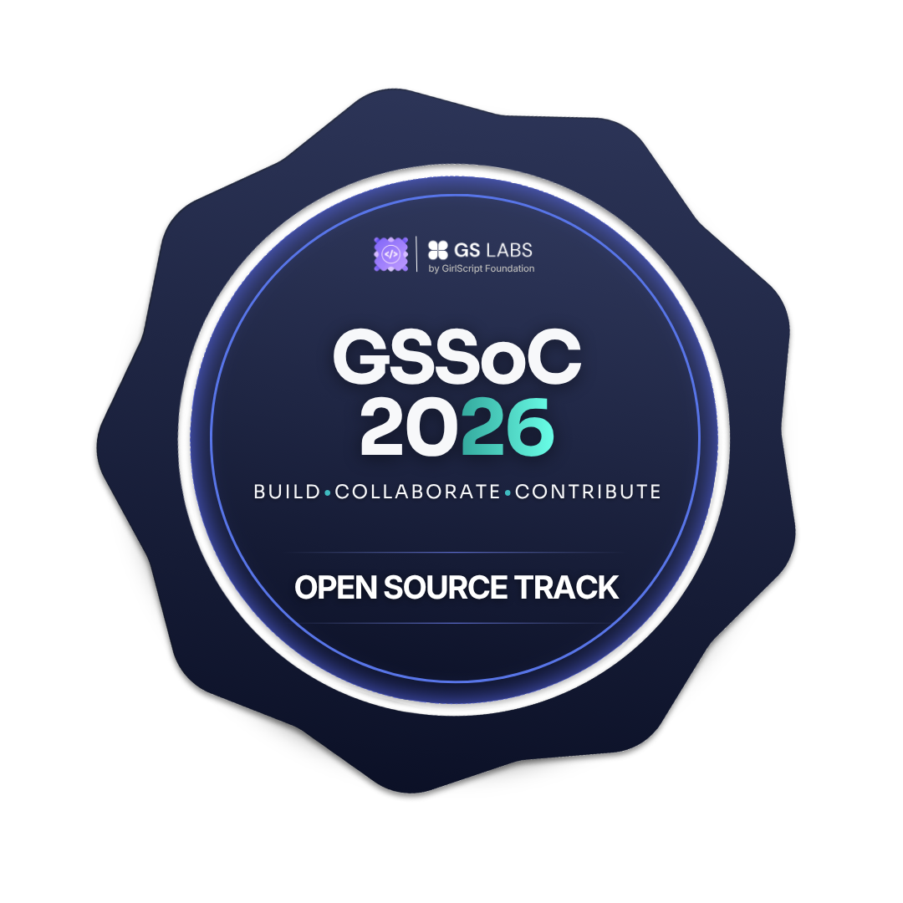

# Hi, I'm Suhanee Gupta 👋

🎓 CSE Student at VIT Vellore  
💻 Passionate about Web Development, React, Java & SQL  
🌱 Open Source Contributor | Aspiring Software Developer

---

## 🏆 Achievements

### GirlScript Summer of Code 2026 ✅

  

**Accepted · GirlScript Summer of Code 2026**  
📌 Tracks: Open Source Track + AI / Agents Track

---

## 🛠️ Tech Stack

---

## 📫 Connect with me

<!--
**suhanee11/suhanee11** is a ✨ _special_ ✨ repository because its `README.md` (this file) appears on your GitHub profile.

Here are some ideas to get you started:

- 🔭 I’m currently working on ...
- 🌱 I’m currently learning ...
- 👯 I’m looking to collaborate on ...
- 🤔 I’m looking for help with ...
- 💬 Ask me about ...
- 📫 How to reach me: ...
- 😄 Pronouns: ...
- ⚡ Fun fact: ...
-->
